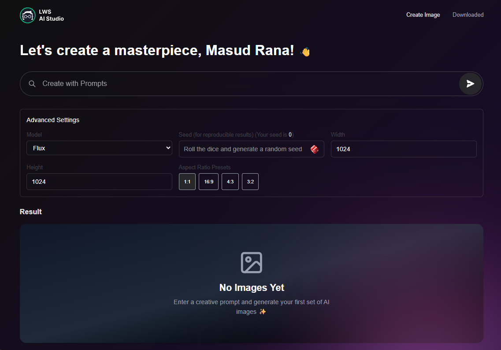

# LWS AI Studio - Pollinations AI Image Generator

A React-based image generator using the Pollinations AI REST API.  
This project allows users to generate images from text prompts, customize advanced settings, and download their favorite images.  
**No external routing library is used; state-based routing is implemented.**

---
## 🖼️ Project Screenshot



---

## 📁 File Structure

```
src/
│
├── App.jsx
├── index.css
├── main.jsx
├── Page.jsx
│
├── assets/
│   ├── logo.svg
│   └── images/
│       ├── ai-image-1.jpeg
│       └── ... (other images)
│
├── Components/
│   ├── EmptyState.jsx
│   ├── ErrorComponent.jsx
│   ├── Loading.jsx
│   ├── WelcomeLogin.jsx
│   ├── createImage/
│   │   ├── CreateImage.jsx
│   │   ├── Glow.jsx
│   │   ├── Navbar.jsx
│   │   ├── PromtInput.jsx
│   │   ├── advanceSettings/
│   │   │   ├── AdanceedSettings.jsx
│   │   │   ├── HeightInput.jsx
│   │   │   ├── Model.jsx
│   │   │   ├── RatioPresets.jsx
│   │   │   ├── SeedInput.jsx
│   │   │   └── WidthInput.jsx
│   │   └── imageParent/
│   │       ├── ImageCard.jsx
│   │       └── ImageParent.jsx
│   └── download/
│       ├── Downloaded.jsx
│       └── DownloadImageCard.jsx
│
├── context/
│   ├── ImageGeneratorContext.js
│   └── LocalStorageContext.js
│
├── hooks/
│   ├── useImageContext.jsx
│   ├── useImageGenerator.js
│   └── useLocalStorage.jsx
│
├── provider/
│   ├── ImageGeneratorProvider.jsx
│   └── LocalStorageProvider.jsx
│
└── utils/
    └── downloader.js
```

---

## ✨ Features

- **State-Based Routing:**  
  No external router. Navigation is handled by a `route` state in `Page.jsx`.

- **Prompt-based Image Generation:**  
  Enter a prompt and generate 9 unique images using Pollinations AI REST API.

- **Advanced Settings:**  
  - **Model Selection:** Fetch and select from available AI models.
  - **Height/Width:** Set custom image dimensions.
  - **Aspect Ratio Presets:** Quick-select ratios (1:1, 16:9, 4:3, 3:2) auto-adjust dimensions.
  - **Seed:** Randomized for each image to ensure uniqueness.

- **Image Gallery:**  
  - Shows 9 images per prompt.
  - Each image displays a loader while loading.
  - Handles image load errors gracefully.

- **Download Functionality:**  
  - Download any generated image.
  - Downloaded images are tracked and listed in the Downloaded section.
  - Prevents duplicate entries in the Downloaded list.

- **Persistent Downloads:**  
  - Downloaded images are stored in localStorage for persistence.

- **User Experience:**  
  - Loading spinners, error messages, and empty states for better UX.
  - Responsive and clean UI.

---

## ⚙️ Functionality Details

### Routing
- Managed via a `route` state in `Page.jsx`.
- Navbar updates the `route` state to switch between "Create Image" and "Downloaded" pages.

### Image Generation
- Uses Pollinations AI REST API.
- On prompt submission (Enter key or button), fetches 9 images with unique random seeds.
- Advanced settings allow model, size, and ratio customization.

### Advanced Settings
- **Model:**  
  Fetched from API, selectable via dropdown.
- **Height/Width:**  
  User-editable or auto-set by ratio presets.
- **Ratio Presets:**  
  Clicking a preset updates height/width accordingly.

### Image Gallery
- Each image card shows a loader until the image loads.
- If image fails to load (timeout or error), displays an error message.

### Download & Downloaded List
- Clicking download saves the image and adds it to the Downloaded list (if not already present).
- Downloaded images are shown in the Downloaded section, persisted via localStorage.

### Error Handling & UX
- All API and image errors are caught and shown to the user.
- Loading and empty states are visually indicated.

---

## 📝 Assignment Requirements Covered

- [x] State-based routing (no external router)
- [x] Prompt input with Enter key and button submission
- [x] Pollinations AI REST API integration
- [x] Advanced settings (model, size, ratio, seed)
- [x] 9 unique images per prompt (random seed)
- [x] Loader and error handling for images
- [x] Download functionality with localStorage tracking
- [x] Downloaded images page
- [x] All state and error management as per assignment

---

## 📢 Notes

- **No external routing libraries used.**
- **All images and downloads are handled via REST API and browser features.**
- **For any issues, check browser console for error logs.**

---

Happy Coding! 🚀